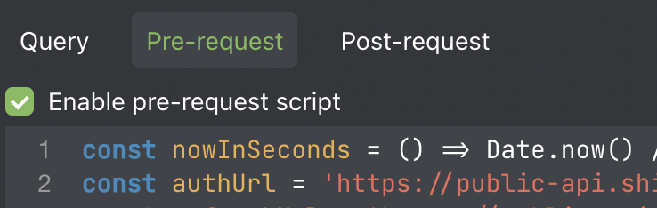
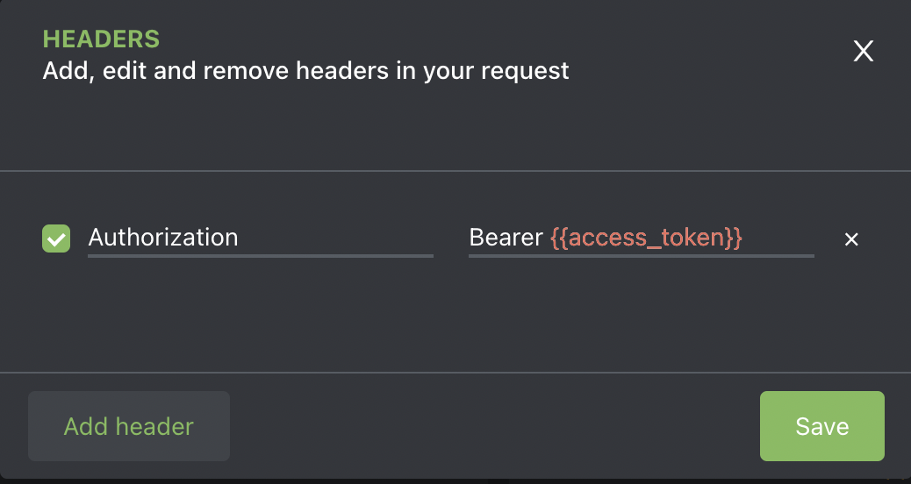

# Altair Shiphero Graphql Setup
Shiphero has transitioned from a rest api to graphql.  As a part of graphql, it is self documenting as you explore the API.  It makes it easier and more flexible to make custom queries.

# Altair
Altair can be installed from the [Altair Website](https://altair.sirmuel.design/)

## Setup a pre-request script

In order to access the graphql api, you must handle authentication.  Your initial log in will be handled with your username and password.  Subsequent reauthorizations are handle by the renewal token.  The script is located in the `config.js` file.  Copy and paste this into the into the pre-request script section and replace the username and password

Make sure that you select to enable the script

## Setup the Auth Headers

Setup the auth headers to use the token set in the script.  Under the headers sections add a new header with the Header Key `Authorization` and the Header value as `Bearer {{access_token}}`.  Case sensitive

## Point it to the GraphQL endpoint

In the url bar at the top, set it to the shiphero graphql endpoint `https://public-api.shiphero.com/graphql` and make sure it is set as `GET`

Now hit the Docs button and explore the all the data

[Shiphero's examples and api reference](https://developer.shiphero.com/)